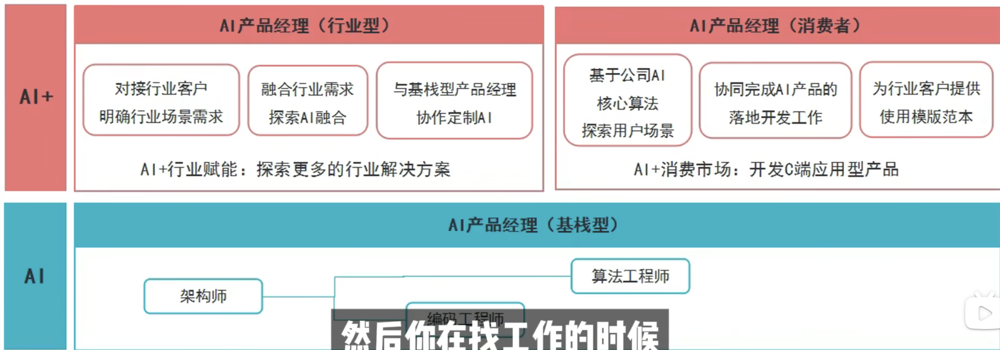

# 2026-06-15 AI 产品经理学习笔记

课程：

- [AI 产品经理从 0 到精通：第一节课](https://www.bilibili.com/video/BV1txKPePExi/?vd_source=f1bfd455e5b3e91cb98ac5a26b7f4b41)

学习时长：35 分钟

## 1. 今天的核心理解

AI 产品经理可以先粗分为两类：

- AI 软件型产品经理
- AI 软硬结合型产品经理

我目前更适合优先切入 `AI 软件型产品经理`，因为它更依赖场景需求挖掘、技术选型、产品开发、数据验证和跨团队协作，和我已有的美团金融策略产品、SQL/指标体系、A-Level Plus AI 批改项目更匹配。

软硬结合型产品经理也很有前景，但会额外要求供应链、硬件工业设计、工程设计、工厂协作、开模试机、可靠性测试和小规模生产经验。短期两个月求职冲刺里，不把它作为主攻方向。

## 2. AI 软件型产品经理

软件型 AI 产品经理的主线是：

1. 场景需求挖掘
2. 技术选型
3. 产品开发
4. 开发测试
5. 产品验证
6. 配合已有产品完成 AI 功能落地

它和底层算法的距离相对更远，不要求自己训练模型，但需要懂得如何选择合适的 AI 供应商、模型能力和工具方案。

对我的启发：

- 我不需要把主线放在训练模型或深度学习推导上。
- 我应该重点补：模型能力边界、AI 供应商/模型选型、Prompt、Agent、RAG、评测集、bad case、PRD、数据指标。
- A-Level Plus 可以包装成“用 AI 能力改造教育批改场景”的软件型 AI 产品案例。

## 3. AI 软硬结合型产品经理

软硬结合型有两条路径：

第一条路径偏软件：

- feature list
- 产品设计
- 开发测试
- 产品验证

第二条路径偏硬件和供应链：

- BOM 规划
- 外观结构沟通
- 洽谈工厂
- 开模试机
- 软硬件联调
- 试样与小规模生产
- 可靠性试机
- 上线

对我的判断：

- 这是朝阳方向，但不是我两个月内最优先的求职切入点。
- 如果未来看 AI 硬件、具身智能、智能教育硬件，可以作为中长期补充。

## 4. 不同 AI 产品岗位的能力差异

找工作时要针对目标岗位补能力，不同类型岗位要求差异很大。

### 基座产品经理

更接近底层模型和平台，需要：

- 精通算法
- 分析数据
- 理解算法对算力大小的需求

这类岗位对技术深度要求高，不是我当前最优先方向。

### AI + 行业型 / 消费者型产品经理

需要：

- 行业背景
- 探索创新能力
- 熟悉产品打造流程
- 能把 AI 放进具体场景里创造价值

这类岗位和我最匹配。我的金融、教育、跨境转化方向都可以作为行业场景。

### AI 软件型产品经理

需要：

- 精通软件产品流程
- 沟通协调能力
- 擅长挖掘产品背景和业务需求
- 能和算法、工程、运营协作完成 AI 功能落地

这也是我的主攻方向。

### AI 软硬结合型产品经理

需要：

- 理解供应链
- 理解硬件工业设计和工程设计
- 熟悉软硬件结合的资源整合
- 准确把握市场动态
- 懂行业、能变现

短期了解即可，不作为主线。

## 5. 两周如何快速成为行业专家

课程里提到的方法可以拆成三步：

### 第一步：构建知识架构

先理解行业生命周期，以及客户在生态链上下游的位置。

我可以应用到两个方向：

- 教育 AI：学生、老师、家长、机构、教材、考试体系、AI 批改工具。
- 跨境电商 AI：商家、用户、平台、支付、物流、客服、营销、税费。

### 第二步：学会检索

可以使用：

- Google Scholar
- MIT / Cambridge 相关知识库
- 北大清华图书库
- 公司内部知识库
- 行业报告和标杆公司资料

对我来说，重点不是收藏资料，而是把资料转成行业地图、用户旅程和产品机会点。

### 第三步：知识分层

把行业知识按不同维度分层：

- 行业
- 区域
- 难易程度
- 学科
- 客户类型
- 产业链上下游

然后基于检索结果检测知识盲点，再补齐。

## 6. 如何培养创新能力

课程提到的方式：

- 参加 AI 行业峰会。
- 尽量和行业专家一对一交流。

我的执行方式：

- 每周至少体验 1 个 AI 产品，并写出目标用户、核心场景、好用点、糟糕点和可复用点。
- 对 Agent/RAG 相关工具做学习型拆解，先服务概念理解，不急着做独立项目。
- 如果能约到已经上岸的 AI PM 或行业老师，优先问“真实工作流”和“面试关注点”。

## 7. 如何快速学习供应链

课程给的方法：

- 找行业前三名，了解最先进的配料、工艺、流程、人才管理和组织结构。
- 找行业后三名，分析上升空间，寻找最佳性价比。
- 建立并维护客情关系。

我的取舍：

- 供应链不是当前主线，但这个方法可以迁移到软件产品调研。
- 对 AI PM 求职来说，我可以找“行业前三名产品”和“尾部产品”做对比，看领先者为什么领先、后来者还有什么机会。

## 8. 今天形成的求职判断

我当前最适合的方向不是基座模型产品，也不是软硬结合产品，而是：

- AI 应用型产品经理
- AI 软件型产品经理
- AI + 金融 / 教育 / 跨境电商方向
- Agent / RAG 应用产品方向

我的能力补齐路线应该是：

1. 用课程建立 AI PM 岗位地图。
2. 用 Coze / Dify 跑通 Agent 和 RAG demo。
3. 用 Datawhale Hello-Agents / All-in-RAG 补系统原理。
4. 每天整理 daily log，形成持续学习记录。
5. 先把学习主线跑顺，再考虑独立项目或作品集。

## 9. 明天继续

明天继续看同一门课，重点关注：

- AI 产品经理具体工作流。
- 大模型能力边界。
- AI 供应商和技术选型怎么判断。
- 哪些内容能直接用于 A-Level Plus 或跨境下单转化 PRD。
